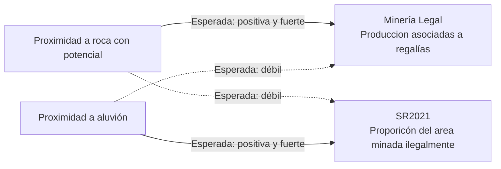

## Exploración: VI
**Fecha:** 7 de septiembre de 2026  
**Estado:** resultados exploratorios de VI

### Regresiones
Con el modelo:
- $Y_{i,t}=Área\ Cosechada_{i,t}$. Considero área total y desagregada por cultivos permanentes y cultivos transitorios.
- $D_{i,t}=Porcentaje\ de\ nueva\ área\ minada\ ilegalmente_{i,t}$
- $X_{i,t}=log(1+area\ solicitada\ minería\ oro_{i,t})$
- $Z_{i,t}=Potencial\ aurifero\ roca_{i}\ X\ precio\ oro_{t}$
Encuentro resultados significativos en los planteamientos de VI simple, VI con efectos fijos de municipio y VI con efectos fijos de año. Pero, los efectos se disuelven cuando considero el modelo con Efectos fijo de municipio y año:

**Y=ProdAgr_total_ACosch**
|              |    VI simple                  |       EF año                  | EF municipio                  | EF municipio & año                  |
| ------------ | :---------------------------: | :---------------------------: | :---------------------------: | :---------------------------: |
| mineIleg\_oro\_nwPrp\_SR21\_pct |       0.0104\*\*   |      0.00401                  |       0.0876\*\*\* |       0.0985                  |
|              |       (2.83)                  |       (1.01)                  |       (5.19)                  |       (1.26)                  |
| log\_tituMine\_oro\_AreaSo\_total |      -0.0249\*     |      0.00477                  |      -0.0213                  |      -0.0256                  |
|              |      (-2.05)                  |       (0.46)                  |      (-0.99)                  |      (-0.96)                  |
| \_cons       |        6.948\*\*\* |                               |                               |                               |
|              |      (39.84)                  |                               |                               |                               |
| *N*          |         5827                  |         5827                  |         5826                  |         5826                  |

**Y=ProdAgr_CCPerm_ACosch**
|              |    VI simple                  |       EF año                  | EF municipio                  | EF municipio & año                  |
| ------------ | :---------------------------: | :---------------------------: | :---------------------------: | :---------------------------: |
| mineIleg\_oro\_nwPrp\_SR21\_pct |       0.0306\*\*\* |       0.0320\*\*\* |       0.0110\*\*   |     -0.00441                  |
|              |       (5.12)                  |       (4.95)                  |       (2.82)                  |      (-0.28)                  |
| log\_tituMine\_oro\_AreaSo\_total |      -0.0329                  |      -0.0426                  |      -0.0112\*     |     -0.00842                  |
|              |      (-1.52)                  |      (-1.85)                  |      (-2.00)                  |      (-1.41)                  |
| \_cons       |        5.119\*\*\* |                               |                               |                               |
|              |      (16.75)                  |                               |                               |                               |
| *N*          |         4868                  |         4867                  |         4858                  |         4857                  |

**Y=ProdAgr_CCTrans_ACosch**
|              |    VI simple                  |       EF año                  | EF municipio                  | EF municipio & año                  |
| ------------ | :---------------------------: | :---------------------------: | :---------------------------: | :---------------------------: |
| mineIleg\_oro\_nwPrp\_SR21\_pct |      -0.0220\*\*\* |      -0.0260\*\*\* |       0.0160\*\*   |      -0.0114                  |
|              |      (-4.32)                  |      (-4.50)                  |       (2.92)                  |      (-0.55)                  |
| log\_tituMine\_oro\_AreaSo\_total |       0.0366\*\*   |       0.0556\*\*\* |     -0.00179                  |      0.00434                  |
|              |       (2.62)                  |       (3.63)                  |      (-0.28)                  |       (0.66)                  |
| \_cons       |        7.344\*\*\* |                               |                               |                               |
|              |      (30.82)                  |                               |                               |                               |
| *N*          |         5768                  |         5768                  |         5766                  |         5766                  |

*t* statistics in parentheses 
\* *p* < 0.05, \*\* *p* < 0.01, \*\*\* *p* < 0.001

Cuando considero $Y$ como área Sembrada (Ha) o producción (ton), el resultado es análogo y menos significativo que el de considerar $Y$ como área cosechada. [Ver las otras regresiones]([../outputs/regresiones](https://github.com/JC-AlfonsoR/PEG-mining-agriculture/tree/main/outputs/regresiones)

## Exploración: Intención de hacer minería legal
**Fecha:** 2 de septiembre de 2026  
**Estado:** resultados exploratorios de primera etapa

## Resultados preliminares
###  Panel con efectos fijos de municipio y año
|  | log(1 + area solicitada título minero) |  | Minería ilegal |  |
|---|---:|---:|---:|---:|
| **Instrumento** | **Roca × P** | **Aluvión × P** | **Roca × P** | **Aluvión × P** |
| Coeficiente | -0.00087*** | -0.00091*** | 0,012061*** | 0,007901*** |
| Error estándar agrupado | (0.00013) | (0.00019) | (0,001774) | (0,002529) |
| Estadístico t | -6.43 | -4.58 | 6,80 | 3,12 |
| Valor p | <0.001 | <0,001 | <0,001 | 0,002 |
| Estadístico F | 41.33 | 20.99 | 46,23 | 9,76 |
| Observaciones | 11.538 | 11.538 | 12.012 | 12.012 |
> Las regresiones absorben efectos fijos de municipio y año.
> Cuando considero el instrumento de potencial general (i.e. proximidad a aluvión o roca en conjunto) los resultados son idénticos a los resultados de solo considerar roca

### Análisis
- El potencial de oro en roca mueve tanto la intención de hacer minería legal (medida como área solicitada de título minero) como la minería ilegal (medida como porcentaje del area minada que se mina ilegalmente). Lo mismo aplica para el potencial de aluvión pero con menor poder de predicción.
- No encuentro instrumentos que muevan solo una de las variables. ¿proceder con instrumento de potencial sobre minería ilegal y controlar por intención de hacer minería legal o viceversa?

## Exploración: potencial aurífero, minería legal e ilegal

**Fecha:** 13 de agosto de 2026  
**Estado:** resultados exploratorios de primera etapa

### Pregunta
¿El potencial aurífero de roca predice principalmente la minería legal,
mientras que el potencial de aluvión predice principalmente la minería ilegal?
> Respuesta: 
> 1. Ninguno de los instrumentos elegidos (potencial en aluvión o en oro) tiene potencial para predecir el indicador de minería legal (producción asociada a regalías)
> 1. El potencial aurifero de roca interactuado con el precio del oro tiene poder para predecir minería ilegal. El potencial aurifero de aluvión también, pero es más bajo.

### Hipótesis

### Resultados preliminares
#### Primera etapa: potencial aurífero × precio del oro

##### Panel A. Panel agrupado sin efectos fijos

|  | Minería legal | Minería legal | Minería ilegal | Minería ilegal |
|---|---:|---:|---:|---:|
| **Instrumento** | **Roca × precio** | **Aluvión × precio** | **Roca × precio** | **Aluvión × precio** |
| Coeficiente | 0,000196*** | 0,000481*** | 0,026444*** | 0,023471*** |
| Error estándar | (0,000071) | (0,000063) | (0,000777) | (0,001140) |
| Estadístico t | 2,77 | 7,67 | 34,04 | 20,59 |
| Valor p | 0,006 | <0,001 | <0,001 | <0,001 |
| Estadístico F | 7,68 | 58,87 | 1.158,44 | 423,78 |
| Observaciones | 2.066 | 2.066 | 12.012 | 12.012 |

##### Panel B. Panel con efectos fijos de municipio y año

|  | Minería legal | Minería legal | Minería ilegal | Minería ilegal |
|---|---:|---:|---:|---:|
| **Instrumento** | **Roca × precio** | **Aluvión × precio** | **Roca × precio** | **Aluvión × precio** |
| Coeficiente | 0,000202 | −0,000171 | 0,012061*** | 0,007901*** |
| Error estándar agrupado | (0,000281) | (0,000189) | (0,001774) | (0,002529) |
| Estadístico t | 0,72 | −0,90 | 6,80 | 3,12 |
| Valor p | 0,474 | 0,368 | <0,001 | 0,002 |
| Estadístico F | 0,52 | 0,81 | 46,23 | 9,76 |
| Observaciones | 2.014 | 2.014 | 12.012 | 12.012 |

> En el Panel A se reportan errores estándar convencionales. En el Panel B,
> los errores estándar se encuentran agrupados por municipio. Las regresiones
> del Panel B absorben efectos fijos de municipio y año.

### Análisis
Las regresiones de panel agrupado y sección transversal año-año (que no se muestran) muestran asociaciones positivas y estadísticamente significativas entre los dos candidatos a instrumento y ambas medidas de minería.

Sin embargo, al incorporar efectos fijos de municipio y año, las relaciones minería legal - roca y minería legal-aluvión se diluyen. Solo las dos relaciones de minería ilegal se mantienen.

Las bases de datos de minería legal (producción asociada a reglías) tiene entre 80-150 observaciones por año en 2012 y 2026; mientras que la base de datos de mienría ilegal (proporción del area minera minada ilegalmente) tiene 1092 observaciones por año entre 2004-2014
