# Esquema procesamiento de datos
- Las bases de datos se muestran con recuadros
    - Las resaltadas en rojo tinen están en el fromato panel que se muestra en la siguiente sección y en ```.dta``` para cargarlas en Stata
- Los scripts de Python se muestran con rombos
- Los scripts de Stata se muestran como círculos

```mermaid
flowchart LR

%% Estilos
classDef base_para_stata stroke:#f00

%% Bases de datos crudas
UPRA_antiguo[UPRA 2007-2018]
UPRA_nuevo[UPRA 2019-2024]
ANM_web[ANM: Servidor ArcGIS]
ANM_titulos_mineros[ANM: títulos mineros]
e2001_poligonos_titulosmineros[data/raw/
e2001_poligonos
titulosmineros]
SGC_zonas_potencial[SGC:
zonas potencial mineral]
SGC_aluviones[SGC:
Aluviones]
UPME_produccion_regalias[UPME:
produccion asociada 
regalias]
SR2021_mineria_ilegal[SR2021
minería ilegal]
DANE_poligonos_municipales[DANE:
poligonos municipales]
WB_pinkSheet_preciosMateriasPrimas[World Bank
Pink Sheet:
Precios Materias Primas]

%% Bases de datos intermedias
e2011_poligonos_titulosmineros_armonizado[data/intermediate/
e2011_ANM_poligonosTitulosMineros]
e2011_SGC_ZonasPotencialMineral_armonizado[data/intermediate/
e2011_SGC_ZonasPotencialMineral_armonizado]
e2011_SGC_Aluviones_armonizado[data/intermediate/
e2011_SGC_Aluviones_armonizado]
e2011_UPME_produccionRegalias[data/intermediate/
e2011_UPME_produccionRegalias_armonizado]
e2011_SR2021_mineriaIlegal[data/intermediate/
e2011_SR2021_mineriaIlegal_armonizado]
e2011_WbPinkSheet_preciosMinerales_armonizado[data/intermediate/e2011
World Bank - Pink Sheet
Precios Minerales armonizado]
e1001_panel_cultivos_UPRA[data/intermediate/
e1001_panel_cultivos_UPRA]



%% Bases de datos intermedias para STATA
e1101_panel_informacion_agricola[data/intermediate/
e1101_panel_informacionAgricola]:::base_para_stata
e2100_panel_IndicadoresGeoEspaciales_Minerales[data/intermediate/
e2100_panel_IndicadoresGeoEspaciales_Minerales]:::base_para_stata
e2101_panel_InfoAdicional_Minerales[data/intermediate/
e2101_panel_InfoAdicional_Minerales]:::base_para_stata
e3000_preciosMinerales[data/intermediate/
e3000 Precios de minerales]:::base_para_stata

%% archivos de configuracion
1001_2_crosswalk_armonizado[data/config/
1001_2_crosswalk_armonizado]
2011_crosswalk_minerales_armonizado[data/config/
2011_crosswalk
minerales_armonizado]


%% engines Python
e1001_processs_UPRA{e1001
processs_UPRA}

e1101_organizar_info_agricola{e1101
Organizar información
Agrícola}




e2001_descargar_poligonostitulosmineros{e2001
descargar
poligonos titulos mineros}

e2011_armonizar_taxonomias_minerales{e2011
armonizar taxonomias
minerales}

e2100_calcular_indicadoresGeoEspaciales_minerales{e2100
Calcular Indicadores Geoespaciales
de Minerales}

e2101_organizar_informacionAdicional_minerales{e2101
Organizar Información Adicional de Minerales}

e3000_procesarPreciosMinerales{e3000
Procesar Precios de minerales}

%% engines STATA
e8100_procesar_datos_minerales((e8100 
Procesar
datos minerales))

e8200_explorar_primera_etapa((e8200 
Explorar primera etapa))

e8500_estimar_VI_especificacion_principal((e8500 
Estimar VI
especificación principal))

%% conexiones


%% e1001_processs_UPRA
UPRA_antiguo---e1001_processs_UPRA
UPRA_nuevo---e1001_processs_UPRA
e1001_processs_UPRA---e1001_panel_cultivos_UPRA
e1001_processs_UPRA---1001_2_crosswalk_armonizado


%% e2001_descargar_poligonostitulosmineros
ANM_web---e2001_descargar_poligonostitulosmineros
ANM_titulos_mineros---e2001_descargar_poligonostitulosmineros
e2001_descargar_poligonostitulosmineros---e2001_poligonos_titulosmineros

%% e2011_armonizar_taxonomias_minerales
e2001_poligonos_titulosmineros---e2011_armonizar_taxonomias_minerales
SGC_zonas_potencial---e2011_armonizar_taxonomias_minerales
SGC_aluviones---e2011_armonizar_taxonomias_minerales
UPME_produccion_regalias---e2011_armonizar_taxonomias_minerales
SR2021_mineria_ilegal---e2011_armonizar_taxonomias_minerales
WB_pinkSheet_preciosMateriasPrimas---e2011_armonizar_taxonomias_minerales

e2011_armonizar_taxonomias_minerales---2011_crosswalk_minerales_armonizado
e2011_armonizar_taxonomias_minerales---e2011_poligonos_titulosmineros_armonizado
e2011_armonizar_taxonomias_minerales---e2011_SGC_ZonasPotencialMineral_armonizado
e2011_armonizar_taxonomias_minerales---e2011_SGC_Aluviones_armonizado
e2011_armonizar_taxonomias_minerales---e2011_UPME_produccionRegalias
e2011_armonizar_taxonomias_minerales---e2011_SR2021_mineriaIlegal
e2011_armonizar_taxonomias_minerales---e2011_WbPinkSheet_preciosMinerales_armonizado

%% e2100_calcular_instrumentos_potencial
e2011_SGC_ZonasPotencialMineral_armonizado---e2100_calcular_indicadoresGeoEspaciales_minerales
e2011_SGC_Aluviones_armonizado---e2100_calcular_indicadoresGeoEspaciales_minerales
DANE_poligonos_municipales---e2100_calcular_indicadoresGeoEspaciales_minerales
e2011_poligonos_titulosmineros_armonizado---e2100_calcular_indicadoresGeoEspaciales_minerales
e2100_calcular_indicadoresGeoEspaciales_minerales---e2100_panel_IndicadoresGeoEspaciales_Minerales


%% Organizar información adicional de minerales
e2011_SR2021_mineriaIlegal---e2101_organizar_informacionAdicional_minerales
e2011_UPME_produccionRegalias---e2101_organizar_informacionAdicional_minerales
e2101_organizar_informacionAdicional_minerales---e2101_panel_InfoAdicional_Minerales

%% Precios de minerales
e2011_WbPinkSheet_preciosMinerales_armonizado---e3000_procesarPreciosMinerales
e3000_procesarPreciosMinerales---e3000_preciosMinerales

%% Pre-procesamiento STATA
e2101_panel_InfoAdicional_Minerales---e8100_procesar_datos_minerales
e2100_panel_IndicadoresGeoEspaciales_Minerales---e8100_procesar_datos_minerales

%% Primera etapa STATA
e8100_procesar_datos_minerales---e8200_explorar_primera_etapa
e3000_preciosMinerales---e8200_explorar_primera_etapa


%% VI
e1001_panel_cultivos_UPRA---e1101_organizar_info_agricola
e1101_organizar_info_agricola---e1101_panel_informacion_agricola
e1101_panel_informacion_agricola---e8500_estimar_VI_especificacion_principal
e3000_preciosMinerales---e8500_estimar_VI_especificacion_principal
e8100_procesar_datos_minerales---e8500_estimar_VI_especificacion_principal

```



# Estructura de los paneles de datos
| Columna | Descripción |
|----------|-------------|
| `codigo_dane_municipio` | Código DANE de 5 dígitos del municipio. |
| `anno` | Año de referencia de la observación. |
| `nombre_variable` | Nombre interno de la variable. |
| `variable_sujeto` | Sujeto o producto al que hace referencia la variable (ej. `cafe`). |
| `variable_medicion` | Tipo de medición (ej. `produccion_ton`, `area_sembrada_ha`). |
| `variable_detalle` | Desagregación adicional de la variable, cuando aplica. |
| `variable_descripcion` | Descripción legible de la variable. |
| `valor` | Valor numérico de la observación. |
| `clasificacion_econometria` | Clasificación de la variable según su uso en los modelos econométricos. |